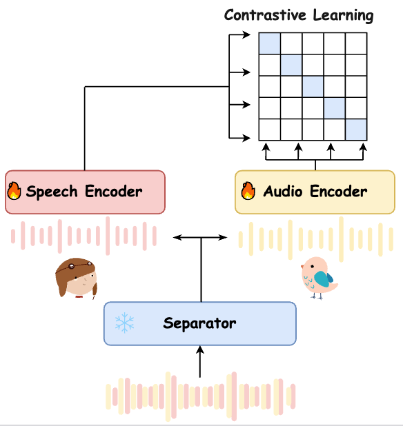

# train-CASP 📎

A PyTorch Lightning solution to training CASP.

## Usage 🚂


training code: 

```bash
cd CASP
bash train.sh
```

inference code: 
```bash
cd CASP
python inference_score_v2c_bench_gt.py
```


<p align="center">
    
</p>


## TODO ✅

- [ ] inference code
  - [x] a simple inference code
  - [ ] a more frinedly inference code
- [ ] training code
- [ ] 3000h ckpt
